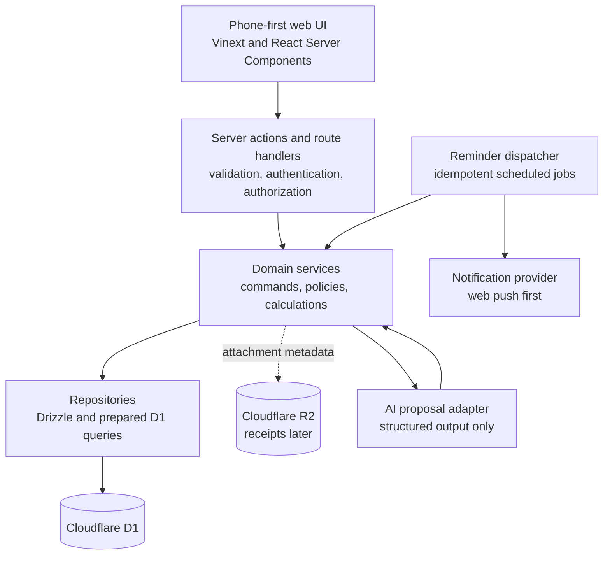
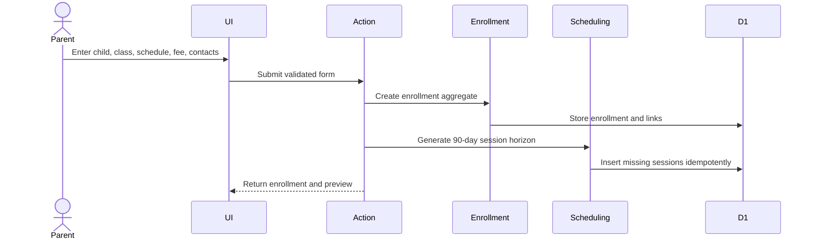
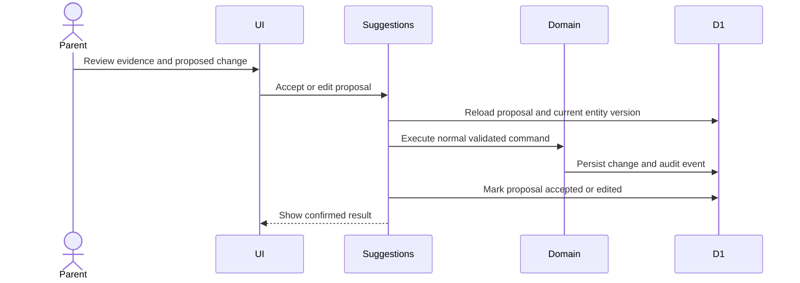

# ClassCue Application Architecture

Status: Proposed implementation baseline completed on 17 July 2026; refine when implementation evidence requires it.

## Architectural approach

ClassCue will be a phone-first modular monolith. One deployable application is simpler for the MVP, while strict domain modules prevent scheduling, attendance, billing, reminders, and AI assistance from becoming coupled.



## Runtime and platform decisions

| Concern | Decision |
| --- | --- |
| Application | Vinext, React, TypeScript, and server-rendered routes with focused client components for interactive forms |
| Deployment | Cloudflare-compatible Sites worker build |
| Structured persistence | Cloudflare D1 with Drizzle schema and generated SQL migrations |
| File storage | R2 only when receipt attachments enter scope; no blob data in D1 |
| Authentication | Dispatch-owned Sign in with ChatGPT for the hackathon MVP, isolated behind an identity service so consumer authentication can replace it later |
| Authorization | Server-side household membership check on every read and write |
| Validation | Shared schemas at the action boundary plus domain invariants inside services |
| Notifications | Provider adapter with web push as the first phone-notification channel |
| AI | Proposal-only adapter returning structured evidence, explanation, and proposed command; never direct database access |

The generated Sites starter is infrastructure, not product architecture. Starter loading screens, sample database code, and unused dependencies should be removed as ClassCue slices replace them.

## Domain modules

```text
app/
  routes and layouts
src/
  modules/
    identity/
    household/
    enrollment/
    scheduling/
    attendance/
    billing/
    reminders/
    suggestions/
  shared/
    db/
    validation/
    money/
    time/
    ids/
    audit/
db/
  schema.ts
drizzle/
  generated SQL migrations
```

Each module owns its commands, queries, policies, repository interface, and tests. Cross-module writes go through public domain services, not direct table access.

### Identity and household

- Resolve the signed-in identity on the server.
- Create or load the user's household.
- Enforce the MVP rule of one active parent while retaining a future membership model.
- Provide an authorization context containing trusted user and household IDs.

### Enrollment and contacts

- Manage children, providers, reusable contacts, and per-child enrollments.
- Archive records without losing history.
- Enforce one primary teacher per enrollment.

### Scheduling

- Version recurrence rules instead of rewriting past schedules.
- Generate a rolling 90-day session horizon idempotently.
- Apply a change to one session or to the current and future schedule rule.
- Preserve originals and explicitly link rescheduled or makeup sessions.

### Attendance

- Record attendance only for eligible sessions.
- Keep attendance and punctuality separate from session status.
- Calculate attendance rate and lateness insights from stored records.

### Billing

- Version fee arrangements.
- Generate explainable charges for monthly, term, package, and per-session models.
- Preserve suggested, adjusted, and parent-confirmed amounts.
- Record payments and calculate due state and balances by currency.
- Maintain prepaid and compensation quantities as a ledger.

### Reminders

- Convert reminder rules into idempotent jobs.
- Recalculate jobs when a session, fee, timezone, or reminder rule changes.
- Stop overdue reminders when a charge becomes paid.
- Keep delivery-provider concerns behind an adapter.
- Manual sharing stays in the browser's native share flow and is never server-initiated.

### AI suggestions

- Read a limited, household-scoped context assembled by a domain query.
- Ask the model for structured evidence, an explanation, and a proposed command.
- Persist the proposal as pending.
- Apply nothing until the parent accepts or edits it.
- Revalidate the proposed command against current records before applying it.

## Primary request flows

### Create an enrollment



### Cancel and create a makeup

The scheduling service validates scope, marks the original session cancelled, creates a separate makeup session, links both records, recalculates reminders, and emits one audit event within a single logical transaction. Attendance remains unset until the makeup occurs.

### Record lateness

The attendance service verifies that the session took place, stores `attended` plus `late` and minutes, and emits an audit event. Insight queries calculate patterns asynchronously or on read; they never change the attendance record.

### Confirm an AI proposal



## Consistency and transactions

- Multi-record operations use D1 batches or transactions where supported by the runtime abstraction.
- Commands carry an idempotency key for retries from mobile networks.
- Version checks prevent an old screen or AI proposal from overwriting newer parent changes.
- Reminder creation and notification delivery are retryable; a unique idempotency key prevents duplicates.
- Audit events are written with the business change, not as a later best-effort task.

## Security and privacy

- Protected pages and mutations require a server-resolved identity.
- Every repository query includes the trusted household boundary.
- Contact details, child data, payment notes, and AI context are private by default.
- AI receives only the minimum fields needed for the active suggestion.
- Sensitive values are excluded from logs; provider secrets are runtime configuration, never repository files.
- Native sharing requires a visible parent gesture and uses a deliberately limited payload.

## Phone-first delivery

- Today is the default signed-in route and returns a single household summary query grouped by child.
- Forms use server actions and progressively enhanced client controls.
- Optimistic UI is limited to reversible presentation state; confirmed records come from the server.
- Dates are rendered in the enrollment or household timezone, not the server timezone.
- A service worker and installable web-app manifest can provide phone-like access and web push without requiring a native app in the MVP.

## Testing strategy

| Level | Focus |
| --- | --- |
| Domain unit tests | recurrence changes, attendance invariants, money and currency rules, fee calculations, credit ledger, AI confirmation policy |
| Repository tests | D1 constraints, household isolation, indexes, migrations, idempotency |
| Integration tests | enrollment generation, cancel/makeup flow, fee payment and reminder cancellation |
| UI tests | critical phone-sized journeys and accessible form behavior |
| Contract tests | notification and AI adapters with deterministic fixtures |

Every migration is generated and inspected. Every stage must pass build, domain tests, and migration checks relevant to its changes.

## Implementation sequence

1. Foundation: curate the generated starter, configure D1, identity boundary, IDs, time, and household ownership.
2. First vertical slice: child → enrollment → recurring schedule → generated sessions → Today view.
3. Attendance and punctuality, including minutes late and insights.
4. Session exceptions, recurrence changes, reschedules, and linked makeups.
5. Fee arrangements, explainable charges, adjustments, payments, and package ledger.
6. Reminder rules, job generation, phone delivery, and native sharing.
7. AI proposal review with evidence, version checks, confirmation, and audit history.

## Decisions deferred until their implementation stage

- The production consumer-auth provider after the hackathon MVP.
- The final web-push provider and scheduled-dispatch mechanism supported by the deployment environment.
- Receipt attachment UX and R2 retention limits.
- Whether complex fee calculations remain TypeScript policies or later become user-configurable rules.

These are isolated behind adapters or versioned configuration so they do not block the first vertical slice.
