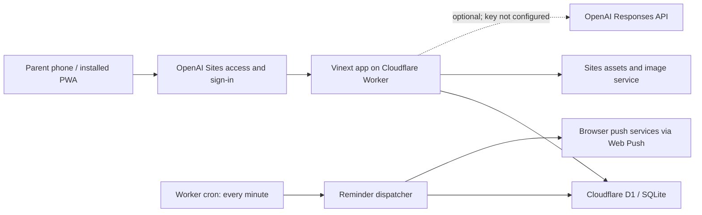
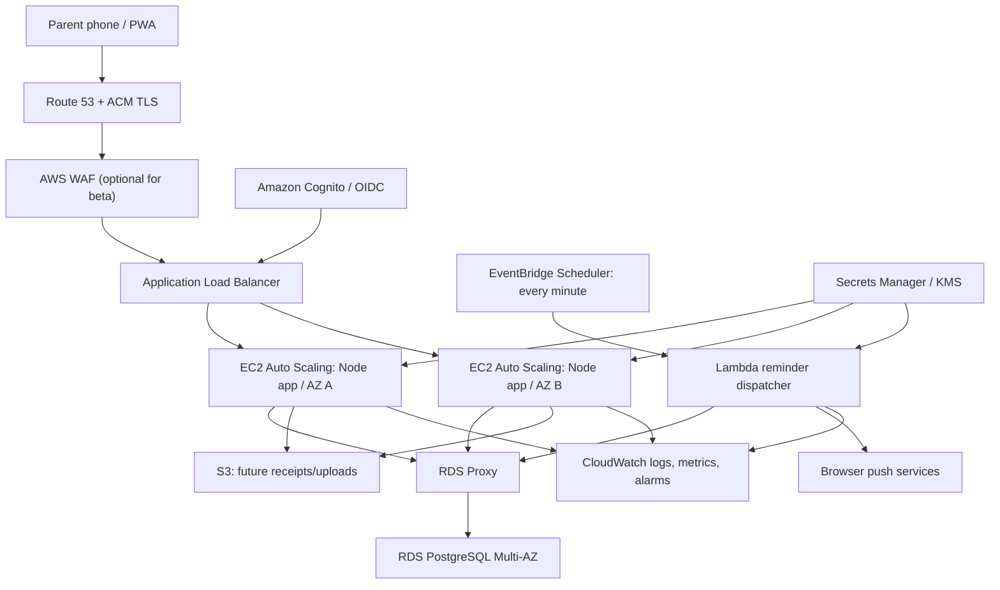

# ClassCue Deployment and AWS Migration Runbook

**Status:** Architecture and migration plan; AWS migration is not yet implemented  
**Last verified:** 18 July 2026, 8:07 AM GST (`Asia/Dubai`)  
**Repository:** `https://github.com/ravikg/classcue.git`  
**Verified commit:** `dc1ae7c`  

## 1. Executive summary

ClassCue currently runs as a private OpenAI Sites application on Cloudflare's Worker runtime. It uses Cloudflare D1 (SQLite), Sites-provided ChatGPT identity headers, a one-minute Worker cron for closed-app notifications, and Web Push signed with VAPID keys. The live application is healthy, but its current access policy permits only the owner account.

The application cannot be copied unchanged onto EC2. Most product UI and domain logic can remain, but the platform adapters must be replaced:

- Cloudflare Worker/Vinext runtime -> standard Node.js Next.js runtime in a container.
- D1/SQLite -> Amazon RDS for PostgreSQL, preferably through RDS Proxy.
- Sites/ChatGPT identity headers -> Amazon Cognito/OIDC claims.
- Worker cron -> EventBridge Scheduler invoking a Lambda dispatcher.
- Worker/Sites configuration -> Secrets Manager, Systems Manager parameters, and workload IAM roles.

The recommended migration is incremental: add portable interfaces first, prove the application against PostgreSQL in a development environment, rehearse data migration, then cut over with a rollback window. Do not decommission the Sites deployment until AWS acceptance checks and data reconciliation pass.

## 2. Current production deployment

### 2.1 Deployment identity

| Item | Current value |
| --- | --- |
| Application URL | `https://classcue-family.open-bream-2302.chatgpt.site` |
| Sites project | `appgprj_6a5a84bae7208191af5015101d04c818` |
| Active Sites version | Version 11 |
| Access policy | `custom`; only `openai@ravikg.com` is currently allowed |
| Git remote | `https://github.com/ravikg/classcue.git` |
| Git branch | `main` |
| Verified Git commit | `dc1ae7c` |
| Database binding | D1 binding named `DB` |
| Object storage | Disabled (`r2: null`) |

The URL is reachable, but it is not public. Other parents cannot use it until the Sites access policy is expanded. Access policy and household authorization are different controls: the platform decides who may enter; ClassCue then isolates each signed-in user's household records.

### 2.2 Runtime diagram

### 2.3 Component inventory

| Concern | Current implementation | Operational consequence |
| --- | --- | --- |
| Web framework | Next.js 16.2.6 and React 19.2.6, built with Vinext 0.0.50 | The application API resembles Next.js, but the emitted server runs as a Worker rather than a conventional Node server. |
| Hosting/runtime | OpenAI Sites on Cloudflare Workers with `nodejs_compat` | Worker bindings are injected into the runtime; there is no EC2 host to administer. |
| Database | Cloudflare D1 with Drizzle's D1 adapter and SQLite tables | SQL, schema definitions, and migration mechanics are SQLite-specific. |
| Database initialization | Idempotent migrations `0000`–`0006`, checked at application startup | Acceptable for the current single logical Worker deployment; unsafe as the long-term migration strategy for multiple EC2 instances. |
| Authentication | Sites/Dispatch supplies `oai-authenticated-user-email` and optional encoded full name headers | The platform owns sign-in routes and identity-header injection. These headers will not exist on AWS. |
| Authorization | Every data operation is scoped to the signed-in user's household | This boundary must be retained independently of the authentication provider. |
| Scheduled jobs | Worker `scheduled()` handler runs every minute | It initializes the DB and dispatches due Web Push jobs. |
| Notifications | Browser Web Push using public/private VAPID configuration | Push delivery has retries, an eight-attempt ceiling, expiry handling, and per-device history. |
| AI | Direct OpenAI Responses API adapter; `gpt-5.6-sol` default; `store: false` | Optional. `OPENAI_API_KEY` is not configured, so the app honestly falls back to deterministic suggestions. |
| Static assets/images | Worker `ASSETS` and `IMAGES` bindings | Replace with standard Next static assets; use S3/CloudFront for future uploaded receipts. |
| Observability | Sites/Worker logs and emitted Worker observability | Useful for engineering diagnosis, but no parent-facing or admin-facing support console exists yet. |
| Delivery | Build locally, package the Sites artifact, create a Sites version, deploy it, then push Git | There is no independent AWS CI/CD pipeline yet. |

### 2.4 Configuration and secrets

The following production keys were observed. Values must never be committed or copied into this document.

| Key | Type | State/purpose |
| --- | --- | --- |
| `VAPID_PUBLIC_KEY` | Configuration | Configured; returned to the browser to create a push subscription. |
| `VAPID_PRIVATE_KEY` | Secret | Configured; signs Web Push requests. |
| `VAPID_SUBJECT` | Configuration | Configured; identifies the push sender. |
| `OPENAI_MODEL` | Configuration | Configured model selection. |
| `OPENAI_API_KEY` | Secret | Not configured; live AI insight generation remains disconnected. |

`.openai/hosting.json` contains only the Sites project identifier and logical D1/R2 binding declarations. It must not contain application secrets.

### 2.5 Data model

The D1 schema contains 23 tables grouped as follows:

- Identity and family: `users`, `households`, `household_members`, `children`.
- Classes and contacts: `providers`, `contacts`, `enrollments`, `enrollment_contacts`.
- Scheduling and attendance: `schedule_rules`, `sessions`, `session_links`, `attendance_records`.
- Finance: `fee_arrangements`, `fee_charges`, `fee_adjustments`, `payments`, `session_credit_entries`.
- Notifications: `reminder_rules`, `reminder_jobs`, `push_subscriptions`, `push_deliveries`.
- Assistance and audit: `suggestions`, `audit_events`.

Money is stored in integer minor units and grouped by ISO currency. Historical sessions, attendance, fee adjustments, payments, reminders, and audit records are preserved when a class is archived.

### 2.6 Important request and job flows

1. **Sign-in and bootstrap:** Sites authenticates the user and injects identity headers. ClassCue resolves or creates the user and household, then loads a household-scoped snapshot.
2. **Parent mutation:** An API route resolves the household, validates the command, writes related records in a transaction where applicable, and records/recalculates dependent data.
3. **Closed-app notification:** The minute cron finds due reminder jobs, sends Web Push to the parent's registered devices, records each delivery, and retries transient failures with backoff.
4. **AI insight:** A parent explicitly requests insights. ClassCue sends pseudonymous aliases and aggregate facts, validates strict structured output, and creates a reviewable proposal. No record changes until the parent accepts it.

## 3. How other parents can use the current application

The current Sites access policy must first be changed from owner-only. Available rollout choices are:

- Add a small named allowlist for a private beta. This is the recommended next step.
- Permit all members of an eligible workspace, if that matches the intended audience.
- Make entry public while still requiring sign-in for private records.

Start with two to five invited parents. Confirm that each new account receives a separate household and cannot access another household's records. Keep an emergency method to remove a user from the platform allowlist.

## 4. Current support and troubleshooting

### 4.1 What exists now

- Worker request and exception logs.
- Database evidence in `audit_events`, `reminder_jobs`, and `push_deliveries`.
- Per-user and per-household ownership on subscriptions and records.
- Git commit history and an identifiable deployed Sites version.
- Automated build, lint, type, contract, household-isolation, PWA, and notification checks.

### 4.2 What is missing

There is no safe admin console. The owner cannot yet search for a support case, inspect a sanitized household timeline, see failed jobs, or correlate a complaint with a release without engineering/database access.

Before a wider beta, add an admin role and a read-mostly support surface with:

- User lookup by email or a user-visible support code.
- Household, child, enrollment, and recent activity summary.
- Reminder rule/job/delivery status and sanitized error codes.
- AI request status, without model inputs containing private details.
- Current application version and deployment time.
- Time-limited support access, explicit parent consent where practical, and an audit record for every admin view or action.
- No display of secret values, VAPID private keys, payment references, or unrestricted cross-household exports.

### 4.3 Incident checklist

1. Record the affected account/support code, time, device/browser, screen, and expected result.
2. Confirm the active release and whether the failure affects one household or all users.
3. Check request errors and latency around the reported time.
4. For notifications, inspect the reminder rule, due job, delivery attempts, subscription ownership, HTTP result, and retry/dead-letter state.
5. For data issues, use audit history and ownership keys before considering any correction.
6. Do not edit financial or attendance history directly. Use a reviewed corrective command that leaves an audit trail.
7. Escalate suspected cross-household access immediately and disable the affected route or release if containment is uncertain.

## 5. Cloudflare/Sites coupling to replace

| Code/configuration | Coupling | AWS replacement |
| --- | --- | --- |
| `.openai/hosting.json` | Sites project and D1 binding | Infrastructure as code plus AWS configuration/secrets. |
| `vite.config.ts` | Vinext, Cloudflare Vite plugin, Worker bindings, cron metadata | Standard Next.js Node build and a Docker image. |
| `worker/index.ts` | Worker `fetch`, `scheduled`, `ASSETS`, `IMAGES`, `D1Database` | Node web entry; separate Lambda reminder entry; standard static/image handling. |
| `db/index.ts` | `cloudflare:workers`, D1 connection, raw bundled migrations | PostgreSQL connection pool and a one-shot migration job. |
| `db/schema.ts` | Drizzle `sqliteTable` and SQLite types | Drizzle `pgTable`, PostgreSQL constraints, indexes, and types. |
| SQL in reminder/bootstrap paths | SQLite functions, conflict syntax, and schema introspection | PostgreSQL-compatible SQL and repository tests. |
| `app/chatgpt-auth.ts` | Sites-owned routes and `oai-*` headers | Cognito/OIDC middleware using a stable subject identifier. |
| Runtime environment reads | Worker environment object | Validated process environment and Secrets Manager retrieval/injection. |

## 6. Recommended AWS target architecture

### 6.1 Baseline using EC2 and RDS

### 6.2 Service mapping

| Need | Recommended AWS service | Reason |
| --- | --- | --- |
| DNS and HTTPS | Route 53 and ACM | Managed DNS and certificate lifecycle. |
| Ingress | Application Load Balancer | HTTPS termination, health checks, and routing across Availability Zones. |
| Application compute | EC2 Auto Scaling group, minimum two instances for production | Familiar EC2 control with rolling replacement and multi-AZ availability. |
| Container images | Amazon ECR | Immutable, versioned application images. |
| Relational database | RDS for PostgreSQL Multi-AZ | Managed backups and failover; matches the relational model better than rewriting for a key-value database. |
| Connection management | RDS Proxy | Pools database connections and reduces connection disruption during failover. |
| Parent authentication | Amazon Cognito user pool or another OIDC provider | Stable user subject, password/social sign-in options, tokens, and admin groups. |
| Reminder schedule | EventBridge Scheduler -> Lambda | Separates minute-based work from web instances and supports retry/DLQ configuration. |
| Secrets | Secrets Manager with KMS | Store database, VAPID, and optional OpenAI credentials; grant access by workload role. |
| Uploaded receipts | S3 with private objects and signed URLs | Add when receipt uploads are implemented; not required for the current MVP. |
| Logs and alarms | CloudWatch Logs, metrics, dashboards, and alarms | Central operational view for web, database, and dispatcher. |
| Host administration | AWS Systems Manager Session Manager | Avoid public SSH and long-lived administrator keys. |
| CI/CD identity | GitHub Actions OIDC -> narrow IAM deployment role | Temporary credentials; no long-lived AWS access keys in GitHub. |

If direct EC2 administration is not a product requirement, ECS on Fargate is a lower-operations alternative for the same Node container. It retains ALB, Cognito/OIDC, RDS PostgreSQL, Lambda, and the rest of this design while removing server patching and Auto Scaling group instance management.

### 6.3 Network and security baseline

- Use one VPC spanning at least two Availability Zones.
- Place only the ALB in public subnets. Put EC2 instances, Lambda networking, RDS Proxy, and RDS in private subnets.
- Permit inbound HTTPS to the ALB; permit application traffic from the ALB security group to the EC2 security group; permit PostgreSQL only from application/Lambda security groups through RDS Proxy.
- Do not assign public IP addresses to application or database instances and do not expose PostgreSQL to the internet.
- Use workload IAM roles, least privilege, encryption at rest, TLS in transit, automated backups, deletion protection, and secret rotation where supported.
- Use Systems Manager instead of SSH. If emergency shell access is required, log and review each session.
- Select an AWS Region only after confirming service availability, legal/data-residency needs, latency, and cost. The current `Asia/Dubai` product timezone does not itself determine the hosting Region.

## 7. Application refactor plan

### Phase A — Create portable boundaries

1. Define an `IdentityProvider` that returns stable `subject`, email, and display name. Keep household authorization downstream of it.
2. Move D1 access behind repositories or a database service so routes do not import Worker bindings.
3. Define validated configuration for database, VAPID, AI, application URL, and release identity.
4. Extract the reminder dispatcher into a platform-neutral function callable by both the current Worker and a future Lambda handler.
5. Define an object-storage interface before adding receipt uploads.

### Phase B — Add PostgreSQL and Node runtime

1. Replace `sqliteTable` with reviewed PostgreSQL schema definitions and use a PostgreSQL Drizzle driver.
2. Translate SQLite-specific behavior, including `INSERT OR IGNORE`, conflict clauses, timestamp/default semantics, boolean representations, date functions, and `pragma_table_info` checks.
3. Run migrations once as an explicit deployment job. Web instances must wait for a successful migration rather than racing to migrate at startup.
4. Produce a standard Next.js Node build and immutable Docker image. Remove the Cloudflare Worker entry only after Node parity tests pass.
5. Add `/health/live` and `/health/ready`; readiness must check required configuration and controlled database connectivity without exposing secrets.

### Phase C — Replace authentication and jobs

1. Configure Cognito/OIDC and map the authenticated `sub` to a new external-identity record. Do not use mutable email as the permanent key.
2. Provide an account-linking process for the existing owner so the old Sites identity resolves to the same ClassCue user and household.
3. Add a Lambda entry for the shared reminder dispatcher. Use EventBridge Scheduler every minute, bounded batch sizes, idempotent claims, retries, and an SQS dead-letter queue.
4. Move VAPID and optional OpenAI credentials to Secrets Manager. Inject or retrieve them through workload roles; never bake them into the image.

## 8. D1-to-PostgreSQL data migration

### 8.1 Rehearsal

1. Create an isolated AWS development database from the PostgreSQL migrations.
2. Export a consistent D1 snapshot without secret configuration.
3. Transform SQLite booleans, timestamps, nullable values, and JSON/text formats explicitly.
4. Import in dependency order:
   `users` -> `households` -> `household_members` -> `children` -> `providers` -> `contacts` -> `enrollments` -> `enrollment_contacts` -> `schedule_rules` -> `sessions` -> `session_links` -> `attendance_records` -> `fee_arrangements` -> `fee_charges` -> `fee_adjustments` -> `payments` -> `session_credit_entries` -> `reminder_rules` -> `reminder_jobs` -> `push_subscriptions` -> `push_deliveries` -> `suggestions` -> `audit_events`.
5. Preserve primary identifiers, ownership relationships, created/updated times, financial minor units/currencies, job states, and audit history.
6. Compare table counts, foreign-key orphans, per-household child/class counts, attendance totals, fee due/paid totals by currency, credit balances, and pending reminder counts.
7. Run the full regression suite and a manual owner journey against the migrated copy.

### 8.2 Cutover

1. Announce a short maintenance window and stop writes to the Sites application.
2. Take the final D1 export and retain an immutable copy under the agreed backup policy.
3. Transform/import, run reconciliation, and smoke-test the AWS application with the production domain configuration.
4. Change DNS only after health, identity linking, household isolation, finance totals, and reminders pass.
5. Monitor errors, authentication, database connections, and notification failures continuously during the rollback window.

Web Push subscriptions are tied to a browser origin and service worker. If the final domain changes, parents must enable notifications again. Keeping the same custom domain across the hosting cutover can reduce that disruption, but it must still be verified on real devices.

### 8.3 Rollback

- Keep the final D1 snapshot and previous Sites version intact.
- During the rollback window, avoid uncontrolled dual writes. If AWS accepts writes, maintain a documented reverse-reconciliation method or declare the AWS data authoritative before returning traffic.
- Roll DNS back to Sites only if identity, data correctness, or core workflows fail and the write-reconciliation decision is understood.
- Do not decommission Sites until the retention window closes and the owner approves the AWS production result.

## 9. AWS delivery pipeline

Recommended flow:

1. Pull request runs dependency audit, lint, TypeScript, tests, and production build.
2. Build an immutable container tagged with the Git commit; scan it and push it to ECR.
3. GitHub Actions obtains temporary AWS credentials using OIDC and a narrowly scoped deployment role.
4. Run the database migration task once and stop if it fails.
5. Roll the new image through the EC2 Auto Scaling group using an instance refresh or CodeDeploy strategy.
6. Require load-balancer health checks and application smoke tests before completing deployment.
7. Record commit, image digest, migration version, operator/workflow, and deployment time.
8. Roll back the application image automatically on failed health checks. Database migrations must be backward-compatible or have a separately reviewed rollback plan.

## 10. AWS operations and admin support

### 10.1 Dashboards and alarms

Create dashboards and alarms for:

- ALB 5xx rate, target response time, rejected connections, and unhealthy hosts.
- EC2 CPU/memory/disk signals, replacement activity, and readiness failures.
- RDS CPU, storage, connections, transaction latency, replica/failover events, and backup failures.
- RDS Proxy connection saturation and borrow latency.
- Lambda errors, duration, throttles, concurrent executions, and DLQ depth.
- Application counters for failed reminder jobs, delivery outcomes, authentication failures, rate limits, and cross-household authorization denials.

Alerts should identify the environment and release and link to a concise runbook. Avoid putting names, contact data, notes, payment references, push endpoints, or request bodies in logs.

### 10.2 Admin authorization

- Put support users in a dedicated Cognito group/claim and enforce it server-side on every admin route.
- Make admin access read-only by default. Require a separate elevated, time-limited action for corrections.
- Scope support views to the minimum data needed and record who accessed which household and why.
- Add a kill switch to disable AI generation or push dispatch independently of the core schedule/fee application.

## 11. Phased delivery and exit gates

| Stage | Deliverable | Exit gate |
| --- | --- | --- |
| 0. Current private beta | Expand allowlist carefully; add support identifiers and admin diagnostics | Two to five parents complete core flows; isolation and support tests pass. |
| 1. Portability | Identity, database, configuration, scheduling, and storage interfaces | Current Sites deployment still passes all tests through the new boundaries. |
| 2. AWS development | Infrastructure as code, Node image, Cognito, RDS PostgreSQL, dispatcher Lambda | Development environment passes automated and manual parity tests. |
| 3. Migration rehearsal | Repeatable D1 export/transform/import and reconciliation report | Two clean rehearsals with no unexplained count or financial differences. |
| 4. Production cutover | Final import, identity linking, DNS switch, monitoring | Owner and beta acceptance pass; rollback window closes without severity-one issues. |
| 5. Decommission | Archive required data and remove unused Sites resources/secrets | Retention, compliance, cost, and restore checks approved by owner. |

## 12. Decisions required before AWS implementation

- Preferred AWS Region after service-availability, residency, latency, and cost review.
- Production domain and whether it can remain stable through cutover.
- EC2 Auto Scaling or the lower-operations ECS/Fargate alternative.
- Beta audience and identity methods (email/password, social providers, or enterprise OIDC).
- Recovery objectives: acceptable data loss (RPO) and restoration time (RTO).
- Expected number of families, reminder volume, and monthly infrastructure budget.
- Who may be an admin and what consent is required for household troubleshooting.

## 13. Acceptance checklist

- [ ] A new parent can sign up, gets exactly one isolated household, and cannot enumerate another household.
- [ ] Existing owner identity links to the existing household without duplicating records.
- [ ] Children, classes, recurrence changes, exceptions, makeup links, attendance, and punctuality match the source.
- [ ] Fee totals, payments, adjustments, credits, and currencies reconcile exactly.
- [ ] In-app reminders and real-device closed-app push pass.
- [ ] Failed jobs retry and reach a visible DLQ/support state without duplicate parent notifications.
- [ ] AI remains optional; disabled/missing credentials do not break core workflows.
- [ ] Admin views enforce role, minimize private data, and generate audit records.
- [ ] Backups restore successfully and the application passes smoke tests after restore.
- [ ] Deployment rollback is exercised before production cutover.

## 14. Primary AWS references

- [EC2 Auto Scaling with an Application Load Balancer](https://docs.aws.amazon.com/autoscaling/ec2/userguide/tutorial-ec2-auto-scaling-load-balancer.html)
- [Authenticate ALB users with Cognito or OIDC](https://docs.aws.amazon.com/elasticloadbalancing/latest/application/listener-authenticate-users.html)
- [Amazon RDS Multi-AZ deployments](https://docs.aws.amazon.com/AmazonRDS/latest/UserGuide/Concepts.MultiAZ.html)
- [Amazon RDS Proxy](https://docs.aws.amazon.com/AmazonRDS/latest/UserGuide/rds-proxy.html)
- [RDS Proxy and Secrets Manager](https://docs.aws.amazon.com/AmazonRDS/latest/UserGuide/rds-proxy-secrets-arns.html)
- [Invoke Lambda with EventBridge Scheduler](https://docs.aws.amazon.com/lambda/latest/dg/with-eventbridge-scheduler.html)
- [EventBridge Scheduler failure handling and DLQs](https://docs.aws.amazon.com/scheduler/latest/UserGuide/managing-schedule.html)
- [IAM OIDC federation for temporary CI/CD credentials](https://docs.aws.amazon.com/IAM/latest/UserGuide/id_roles_providers_oidc.html)
