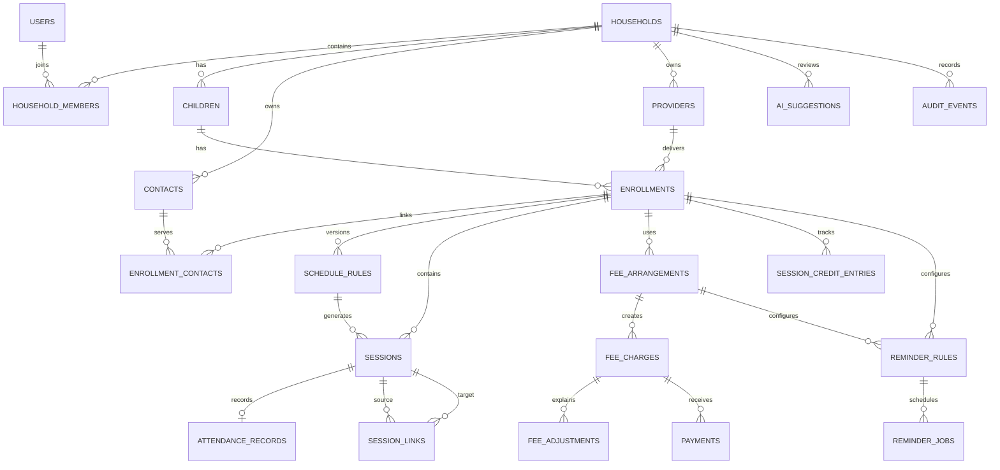

# ClassCue Data Model

Status: Proposed implementation baseline completed on 17 July 2026; refine when implementation evidence requires it.

## Design goals

The model must preserve history, keep schedule changes separate from attendance, support mixed fee arrangements, avoid duplicate contacts, and ensure that every AI-proposed change remains under parent control.

The first implementation will use Cloudflare D1 through Drizzle ORM. Identifiers are application-generated text IDs, dates are stored as ISO values, money is stored as integer minor units, and every household-owned record carries a `household_id` directly or through an enforced parent relationship.

## Relationship overview

## Core entities

### Identity and household

| Entity | Purpose | Important fields |
| --- | --- | --- |
| `users` | Authenticated parent identity. | `id`, normalized `email`, optional display name, auth provider, external subject, timestamps |
| `households` | Ownership boundary for all private family data. | `id`, name, default timezone, created by user, timestamps |
| `household_members` | Connects users to a household. The MVP permits one active owner. | `household_id`, `user_id`, role, status, joined at |
| `children` | Child profile used to group schedules, attendance, and fees. | `id`, `household_id`, name, optional color/avatar key, archived at, timestamps |

The membership table supports a later second-parent account without changing ownership on every product table. The application enforces one active owner during the MVP.

### Contacts and enrollments

| Entity | Purpose | Important fields |
| --- | --- | --- |
| `providers` | Institute, club, tutor business, or independent teacher organization. | `id`, `household_id`, name, website, notes, archived at |
| `contacts` | Reusable people or support contacts. | `id`, `household_id`, optional `provider_id`, name, phone, email, notes, archived at |
| `enrollments` | One child's participation in one extracurricular class. | `id`, `household_id`, `child_id`, optional `provider_id`, subject, display name, location type, location/online link, timezone, start/end dates, status |
| `enrollment_contacts` | Reuses a contact across enrollments and assigns its role. | `enrollment_id`, `contact_id`, role, `is_primary` |

Enrollment contact roles are `teacher`, `administration`, `payment_support`, and `other`. Only one primary teacher is allowed per enrollment.

Separate enrollments are retained for siblings even when the activity looks identical. Providers and contacts can be shared.

### Scheduling and attendance

| Entity | Purpose | Important fields |
| --- | --- | --- |
| `schedule_rules` | Versioned recurring weekly schedule. | `id`, `enrollment_id`, weekday, local start time, duration minutes, timezone, location override, valid from/to, superseded at |
| `sessions` | Concrete class occurrence, including generated and exceptional sessions. | `id`, `enrollment_id`, optional `schedule_rule_id`, planned start/end UTC, timezone, local date, status, source, reason, version, timestamps |
| `session_links` | Explicit relationship between an original and replacement session. | `source_session_id`, `target_session_id`, link type, created at |
| `attendance_records` | Attendance and punctuality for a session that took place. | `session_id`, attendance status, punctuality, minutes late, note, recorded by/at, updated at |

Session statuses are `scheduled`, `cancelled`, `rescheduled`, `holiday`, and `makeup`. Whether a scheduled session is in the past is derived from time; a schedule change never doubles as attendance.

Session links use `reschedule` or `makeup`. The original session stays in history, and a replacement is a separate session. A rolling generator creates the next 90 days of sessions and is safe to run more than once.

Attendance rules:

- attendance is `attended` or `absent`; a missing row means not yet recorded;
- punctuality is required only for `attended` and is `on_time` or `late`;
- `minutes_late` is required and greater than zero only when punctuality is `late`;
- cancelled, rescheduled, and holiday sessions cannot receive attendance;
- on-time is the UI default, but it is stored only after parent confirmation.

### Fees, payments, and session balances

| Entity | Purpose | Important fields |
| --- | --- | --- |
| `fee_arrangements` | Versioned commercial terms for an enrollment. | `id`, `enrollment_id`, model, currency, base amount minor, sessions included, billing cadence, valid from/to, compensation policy, configuration JSON |
| `fee_charges` | Amount expected for a period, term, package, or session. | `id`, `fee_arrangement_id`, period start/end, due date, suggested amount minor, confirmed amount minor, currency, status, calculation snapshot, timestamps |
| `fee_adjustments` | Explainable additions, discounts, carry-forwards, or overrides. | `id`, `fee_charge_id`, optional `session_id`, kind, amount minor, session quantity, reason, source, created at |
| `payments` | Parent-recorded payment against a charge. | `id`, `fee_charge_id`, amount minor, currency, paid at, method, reference, note, created by/at |
| `session_credit_entries` | Append-only ledger for prepaid or compensated sessions. | `id`, `enrollment_id`, optional charge/session IDs, entry type, quantity, reason, occurred at |

Fee models are `monthly`, `term`, `package`, and `per_session`. Compensation policy is explicit: `none`, `makeup`, `credit`, or `manual`.

Charge status is `draft`, `due`, `paid`, `waived`, or `void`. Overdue is derived from a due charge whose due date has passed. Paid and due totals are always grouped by currency.

The confirmed amount is the parent's accepted amount. If it differs from the suggestion, an adjustment reason is required. The calculation snapshot preserves the inputs and explanation used at confirmation time.

Payment methods initially support `cash`, `bank_transfer`, `card`, `online`, and `other`. Partial payments are representable even if the first UI focuses on due and paid.

Session credit entry types are `purchase`, `use`, `restore`, `compensate`, `expire`, and `manual_adjustment`. The remaining balance is calculated from the ledger rather than overwritten.

### Reminders, AI proposals, and history

| Entity | Purpose | Important fields |
| --- | --- | --- |
| `reminder_rules` | Parent configuration for class or fee notifications. | `id`, optional enrollment/fee arrangement IDs, type, lead minutes, repeat interval, enabled, timezone |
| `reminder_jobs` | Idempotent delivery queue and delivery history. | `id`, rule ID, related record type/ID, scheduled for, status, attempts, provider message ID, sent at |
| `ai_suggestions` | Reviewable proposal that cannot directly mutate product data. | `id`, `household_id`, type, evidence JSON, proposed action JSON, explanation, status, reviewed by/at, expires at |
| `audit_events` | Append-only history of consequential parent actions and accepted proposals. | `id`, `household_id`, actor user ID, entity type/ID, action, before/after JSON, occurred at |

AI suggestion status is `pending`, `accepted`, `edited`, `dismissed`, or `expired`. Accepting a proposal invokes the same validated domain command used by a manual parent action and writes an audit event.

## Cross-cutting rules

- All household data access is scoped server-side; client-supplied household IDs are never trusted.
- Money uses integer minor units plus ISO 4217 currency codes.
- Concrete instants use UTC; recurrence rules also retain their IANA timezone and local time.
- Historical financial and session records are immutable except through explicit corrective actions recorded in the audit log.
- Enrollments, children, contacts, and providers are archived rather than deleted when history exists.
- Mutable aggregate roots carry a version for optimistic concurrency checks.
- Free-form JSON is limited to snapshots, provider payloads, and evolving configuration; searchable business fields remain relational.

## Required indexes and uniqueness

- unique normalized user email per auth provider;
- unique `(household_id, user_id)` membership;
- indexes on every household ownership path;
- unique active primary teacher per enrollment;
- unique generated session key `(schedule_rule_id, local_date)`;
- indexes on session start, enrollment, status, and local date;
- one attendance record per session;
- unique session link tuple and prevention of self-links;
- indexes on charge due date/status and payment charge ID;
- unique reminder-job idempotency key for rule, related record, and scheduled time;
- indexes on pending AI suggestions and audit entity lookup.

## Data intentionally deferred

- Receipt bytes: later stored in R2, with attachment metadata in D1.
- Homework, topics taught, progress, and tutor-entered data.
- Payment processor transactions and bank integrations.
- Full notification-provider payloads beyond minimal delivery diagnostics.

## First implementation slice

The first schema migration should include households, users, members, children, providers, contacts, enrollments, enrollment contacts, schedule rules, sessions, and attendance. Billing, reminders, and AI proposal tables follow as separate migrations so each domain can be tested independently.
